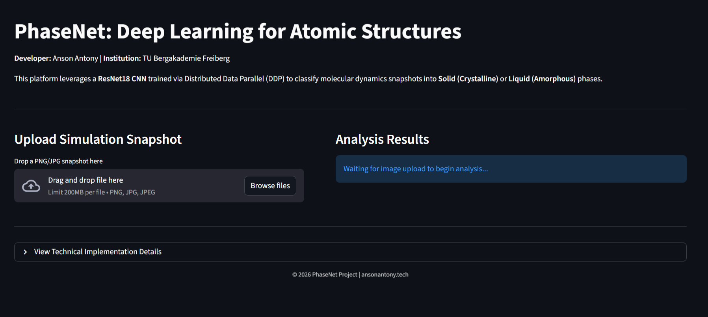
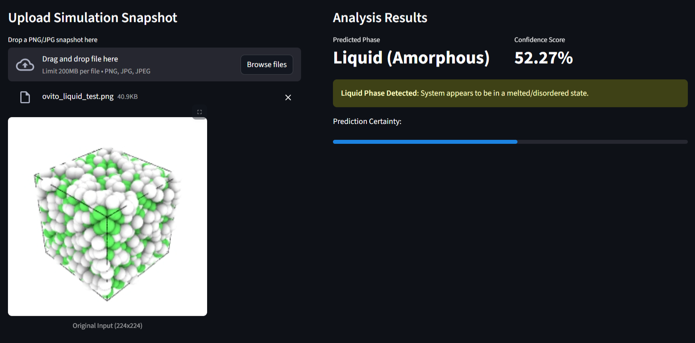
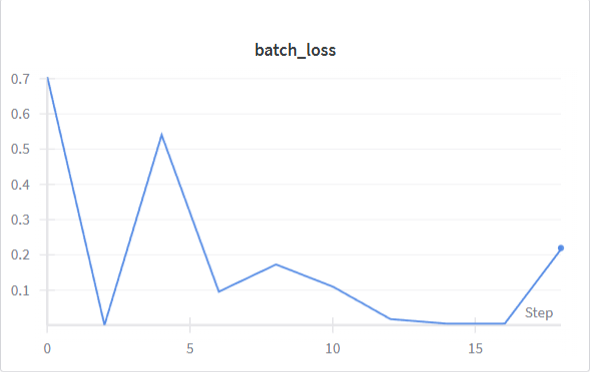

# PhaseNet: Deep Learning for Atomic Structure Classification

PhaseNet is a deep learning project designed to classify molecular dynamics simulation snapshots into **Solid (Crystalline)** or **Liquid (Amorphous)** phases. Leveraging the power of Computer Vision and High-Performance Computing (HPC), it uses a ResNet-18 Convolutional Neural Network (CNN) trained via Distributed Data Parallel (DDP) techniques.



## Project Overview

This tool automates the identification of phase states in atomic simulations, specifically focusing on Copper (Cu) atoms. It replaces manual inspection with a robust deep learning model capable of distinguishing between:
*   **Solid Phase:** Characterized by Face-Centered Cubic (FCC) symmetry.
*   **Liquid Phase:** Characterized by disordered, amorphous atomic arrangements.

### Key Features
*   **HPC-Ready Training:** Implements PyTorch **Distributed Data Parallel (DDP)** to scale training across multiple GPUs.
*   **LAMMPS Simulation:** Uses real molecular dynamics simulations of melting Copper to generate the primary training dataset.
*   **Synthetic Test Data:** Includes OVITO scripts to generate "dummy" snapshots for rapidly testing the model pipeline.
*   **Interactive Web App:** A Streamlit-based user interface for real-time inference.

---

## Technical Architecture

The project is structured into three main modules:

1.  **Simulation & Training Data (`simulation/` & `data/`)**:
    *   **Raw Data:** `simulation/` contains `in.melt_copper` (LAMMPS input) and `melt.lammpstrj` (Trajectory), which simulates the melting process of Copper.
    *   **Training Set:** `data/train/` contains the processed snapshots used to train the model. *Note: This folder is generated from the simulation files and is not included in the repo.*
2.  **Training Pipeline (`src/`)**:
    *   `train_ddp.py`: The main training script using `torchrun`. It loads data from `data/train`.
    *   `model.py`: Defines the ResNet-18 architecture.
3.  **Inference & Testing (`generation/` & `app/`)**:
    *   **Data Processing:** `render_snapshots.py` converts raw LAMMPS trajectories into labeled PNG snapshots for training.
    *   **Dummy Data:** `ovito_dummy_data_gen.py` generates synthetic test images (FCC lattices and random liquids) into `dummy_data/` for rapid interface testing.
    *   **App:** `main.py` is the Streamlit web interface.

---

## Installation & Setup

### Prerequisites
*   **OS:** Linux (Recommended for HPC)
*   **Python:** 3.8+
*   **CUDA:** Enabled GPU (for training)
*   **OVITO Pro:** Required for running data generation scripts.

### Step 1: Clone and Install Dependencies
Navigate to the project directory and install the required Python packages:

```bash
cd PhaseNet
pip install -r requirements.txt
```

### Step 2: Generate Training Data
Since the large training dataset is not version-controlled, you must generate it from the raw simulation trajectory:

```bash
python generation/render_snapshots.py
```
This script processes `simulation/melt.lammpstrj` and populates the `data/train/` directory with labeled **solid** and **liquid** snapshots.

---

## Usage Guide

### 1. Training the Model
Train the model using the dataset generated in `data/train`. The following command runs training on a single node with 2 GPUs.

```bash
torchrun --nproc_per_node=2 src/train_ddp.py
```
*   **Input:** Data from `data/train`.
*   **Output:** Saves weights to `models/crystalline_classifier.pt`.

### 2. Generating Test Data (Optional)
To verify the web app works without needing raw simulation files, you can generate synthetic "dummy" snapshots.

```bash
python generation/ovito_dummy_data_gen.py
```
*   **Output:** Creates `ovito_solid_test.png` and `ovito_liquid_test.png` in `~/PhaseNet/dummy_data`.
*   **Use Case:** Upload these images to the web app to check if the model correctly classifies them.



### 3. Running the Web Application
Launch the inference interface.

```bash
streamlit run app/main.py
```
Open your browser to the URL provided. Upload images from `dummy_data/` or your own simulation snapshots to get a classification.

---

## Results & Performance

The model shows rapid convergence due to the distinct visual features of ordered vs. disordered states.

### Training Loss
Rapid decrease in loss indicates effective learning of the phase boundaries.

**Batch Loss:**


**Epoch Loss:**


---

## Project Structure

```text
PhaseNet/
├── app/
│   └── main.py                 # Streamlit Web Application
├── data/
│   └── train/                  # Generated Training dataset (Ignored by Git)
├── dummy_data/                 # Synthetic test images (generated by script)
├── generation/
│   ├── ovito_dummy_data_gen.py # Script to create dummy test data
│   └── render_snapshots.py     # Script to generate training data from simulation
├── images/                     # Documentation images
├── models/                     # Saved model weights
├── simulation/
│   ├── in.melt_copper          # LAMMPS input script
│   └── melt.lammpstrj          # Raw simulation trajectory
├── src/
│   ├── dataset.py              # Data loading logic
│   ├── model.py                # Model definition
│   └── train_ddp.py            # Training script
├── requirements.txt            # Python dependencies
└── README.md                   # Project Documentation
```

---

## Developer Info
**Developer:** Anson Antony
**Institution:** TU Bergakademie Freiberg
**Contact:** ansonantony.tech

© 2026 PhaseNet Project
